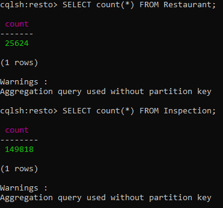

# P25_cluster_cassandra_restaurants

Aude, Ludivine

## Création du Docker-Compose

Voir le contenu du docker compose dans [docker-compose.yml](docker-compose.yml)

pour démarrer la stack docker-compose :<br>
`docker-compose up -d`

vérifier le statut de la stack :<br>
`docker-compose ps`

pour monitorer l'état des clusters :<br>
`docker exec cass1  nodetool status`

et vérifier que CQL fonctionne sur le cluster :<br>
`docker exec -it cass1 cqlsh  -e "describe keyspaces"`

## Création de la base de données

démarrer le shell cqlsh : <br>
```cql
docker exec -it cass1 cqlsh
```

Création de la base de données:<br>
```cql
CREATE KEYSPACE IF NOT EXISTS resto_NY WITH REPLICATION = { 'class' : 'SimpleStrategy', 'replication_factor': 1};
```

Sélectionner cette base :<br>
```cql
USE resto;
```

Création des tables :<br>
```cql
 CREATE TABLE Restaurant (
   id INT, Name VARCHAR, borough VARCHAR, BuildingNum VARCHAR, Street VARCHAR,
   ZipCode INT, Phone text, CuisineType VARCHAR,
   PRIMARY KEY ( id )
 ) ;
 
  CREATE TABLE Inspection (
   idRestaurant INT, InspectionDate date, ViolationCode VARCHAR,
   ViolationDescription VARCHAR, CriticalFlag VARCHAR, Score INT, GRADE VARCHAR,
   PRIMARY KEY ( idRestaurant, InspectionDate )
 ) ;
 ```
 
Création des index :
```cql
CREATE INDEX TypeResto ON Restaurant ( CuisineType ) ;
CREATE INDEX GradeInspec ON Inspection ( Grade ) ;
```

Copier les fichiers dans le conteneur à partir de docker :<br>
`docker cp :/<PATH-TO-CSV> <CONTAINER-ID>:/`
_dans notre cas_<br>
`docker cp :/mnt/c/ubu/cassandra/restaurants.csv a3a6aee998df:/`<br>
`docker cp :/mnt/c/ubu/cassandra/restaurants_inspections.csv a3a6aee998df:/`<br>

```cql
use resto ;
COPY Restaurant (id, name, borough, buildingnum, street, zipcode, phone, cuisinetype) 
        FROM '/restaurants.csv' 
        WITH DELIMITER=',';
COPY Inspection (idrestaurant, inspectiondate, violationcode, violationdescription, criticalflag, score, grade) 
        FROM '/restaurants_inspections.csv' 
        WITH DELIMITER=',';
```

Lorsque l'importation est terminée, on peut vérifier le nombre de lignes importées avec la commande `count`


## API

Nous avons créé une API pour accéder :
- aux infos d'un restaurant à partir de son id,
- à la liste des noms de restaurants à partir du type de cuisine,
- au nombre d'inspection d'un restaurant à partir de son id restaurant,
- les noms des 10 premiers restaurants d'un grade donné.

Dans le dossier où sont stockés les fichiers de l'API (api.py et connexion.py), nous créons un Dockerfile afin de créer une image de notre API dans Docker.
La structure de dossiers est la suivante :
```bash
.
├── app
│   └── api.py
│   └── connexion.py
└── Dockerfile
```

_Contenu du Dockerfile :_ (voir la documentation [fastapi-docker](https://fastapi.tiangolo.com/deployment/docker))
```bash
FROM tiangolo/uvicorn-gunicorn-fastapi:python3.8
RUN pip install fastapi uvicorn
COPY ./app /api
```

La construction de l'image se lance ensuite dans le shell avec la commande suiante :
```bash
docker build -t resto_img .
```

Puis on contruit le container de l'API à partir de cette image, en connectant manuellement le container de l'API au network de nos containers cassandra (ici `cassandra-cassandra`) :
```bash
docker run -d --name api_cont -p 80:80 --network=cassandra_cassandra resto_img
```


